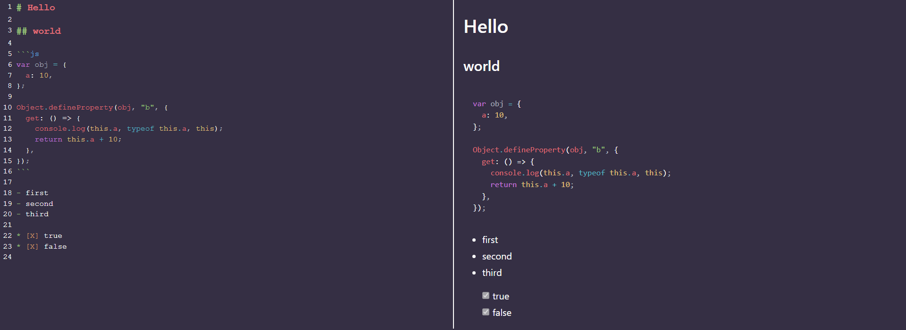

# Markdown editor



## Stack

- [React](https://react.dev/) - The library for web and native user interfaces
- [Vite](https://vitejs.dev/) - Build tool that aims to provide a faster and leaner development experience for modern web projects.
- [Codemirror](https://codemirror.net/) - code editor component for the web
- [Electron](https://www.electronjs.org/) - Electron is a framework for building desktop applications using JavaScript, HTML, and CSS.
- [Remark](https://remark.js.org/) - Markdown processor powered by plugins

## Instalation

1. Clone this repo ([how to clone a repo](https://docs.github.com/en/repositories/creating-and-managing-repositories/cloning-a-repository))
2. Install dependencies
3. Run

```sh
npm install
```

```sh
npm run watch
```

## Project Structure

The entire source code of the program is divided into three modules (packages) that are bundled each independently:
- [`packages/main`](packages/main)
Electron [**main script**](https://www.electronjs.org/docs/tutorial/quick-start#create-the-main-script-file).
- [`packages/preload`](packages/preload)
Used in `BrowserWindow.webPreferences.preload`. See [Checklist: Security Recommendations](https://www.electronjs.org/docs/tutorial/security#2-do-not-enable-nodejs-integration-for-remote-content).
- [`packages/renderer`](packages/renderer)
Electron [**web page**](https://www.electronjs.org/docs/tutorial/quick-start#create-a-web-page).

### Build web resources

Packages `main` and `preload` are built in [library mode](https://vitejs.dev/guide/build.html#library-mode) as it is a simple javascript.
`renderer` package build as regular web app.

The build of web resources is performed in the [`scripts/build.js`](scripts/build.js). Its analogue is a sequential call to `vite build` for each package.